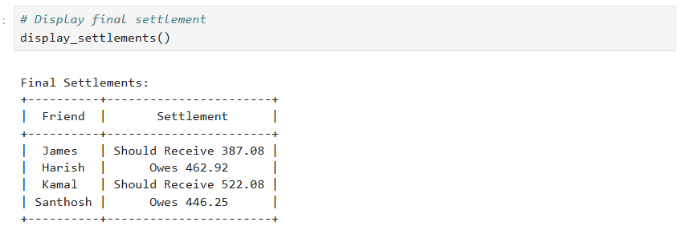
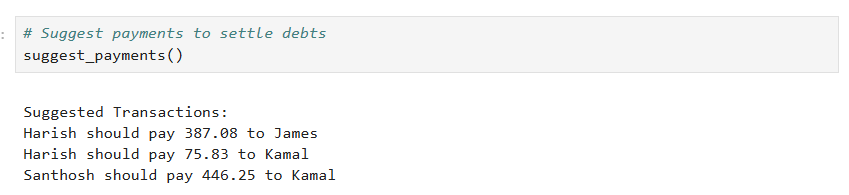

# Expense-Sharing-System

## Description:
This project implements a simple expense sharing system similar to Google Pay / Splitwise.
A Python-based Google Pay style expense sharing system that splits bills, tracks balances between friends, and suggests settlement payments using NumPy and PrettyTable.

## Features:
- Add shared expenses
- Automatic equal split calculation
- Track who owes whom
- Settlement summary
- Optimized payment suggestions

## Technologies:
- Python 3.13.12
- NumPy 2.4.2
- PrettyTable 3.17.0
- Jupyter Notebook 7.0.8

## Setup
Follow the steps below to run the project locally.

1. Clone the repository:
git clone https://github.com/jamesalwin1/expense-sharing-system.git

2. Navigate to the project folder:
cd expense-sharing-system

3. Install the required dependencies:
pip install numpy prettytable

4. Open the Jupyter Notebook:
jupyter notebook

5. Run the notebook file:
gpay Expense Sharing.ipynb

## Dependencies
The project requires the following Python libraries:
- **NumPy** – used for numerical operations and matrix calculations
- **PrettyTable** – used to display settlement results in a formatted table

Development environment:
- **Jupyter Notebook** – used to run and demonstrate the project

Install them using:
pip install numpy prettytable

## Usage
1. Open the Jupyter Notebook.
2. Run all cells sequentially.
3. Add expenses using the `add_expense()` function.
4. View the final balances using `display_settlements()`.
5. Generate optimized payment suggestions using `suggest_payments()`.

Example:
add_expense("James", ["James", "Harish", "Kamal"], 1250)
add_expense("Harish", ["Harish", "Kamal"], 800)
add_expense("Kamal", ["James", "Harish", "Kamal", "Santhosh"], 1785)

**display_settlements()**
shows the final balances between friends.

**suggest_payments()**
suggests the optimized transactions required to settle debts.

## Example Output
### Final Settlement

### Suggested Transactions

